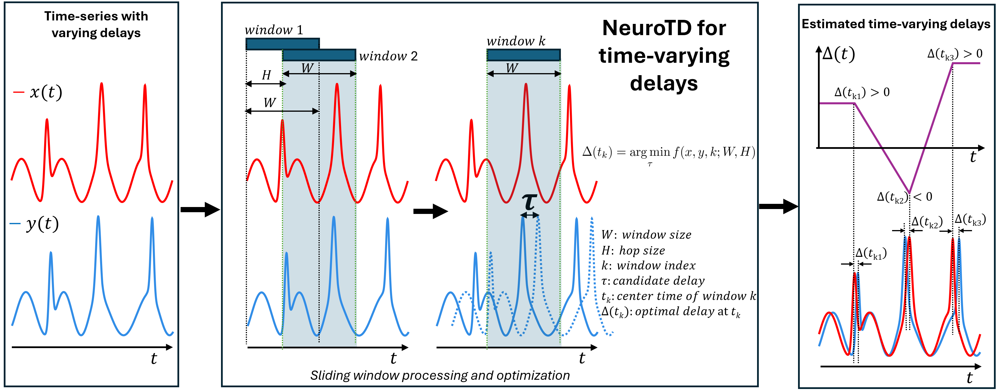
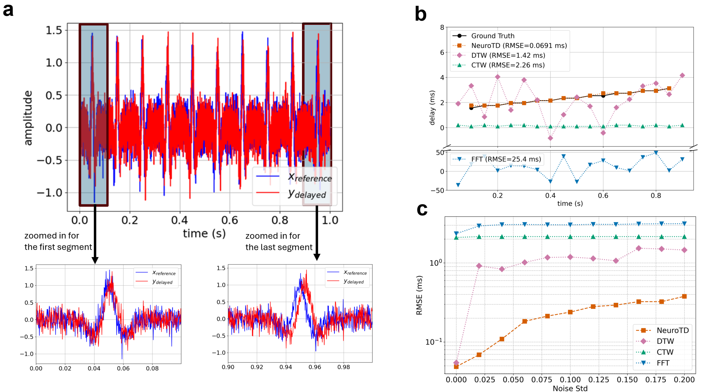
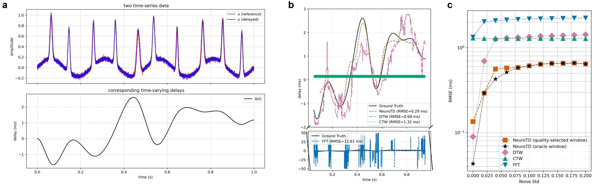

# NeuroTD infers time varying delays in neural activities by adaptive sliding window alignment

Studying the temporal dynamics of neural activities is essential for understanding how neurons function. These dynamics often involve temporal delays between neurons that vary over time, revealing both their functions and how they interact within circuits. Recent techniques such as Neuropixels, depth electrodes, and Patch-seq enable time-series recordings of neural activity at various scales, ranging from single neurons to large populations. However, inferring such time-varying delays remains challenging due to noise, high sampling rates, and complex temporal patterns.

To address these challenges, NeuroTD is introduced as a computational framework based on adaptive sliding-window alignment for inferring time-varying delays between time-series signals. NeuroTD integrates automatic window-size selection via an internal quality score to achieve robust and high-resolution delay estimates without manual tuning. The method is benchmarked extensively in simulation studies and applied to real-world electrophysiological datasets.

Specifically, NeuroTD is evaluated on two real datasets:
(i) intracranial multi-channel electrophysiological recordings from depth electrodes across medial temporal lobe regions in humans, where hippocampal signals exhibit consistently longer delays than other regions during working memory tasks; and
(ii) Patch-seq recordings from mouse motor cortex, where intrinsic electrophysiological time-delay features of excitatory neurons are correlated with gene expression, highlighting pathways related to ion transport and neuronal excitability.



_Figure 1_: NeuroTD infers time-varying delays using adaptive sliding-window alignment. Two time-series with changing delays are analyzed by segmenting the signals into overlapping indows and estimating the optimal local shift in each window. The resulting sequence of window-wise estimates is combined to recover a continuous time-varying delay profile, capturing both positive and negative delays over time under noisy conditions.

## Installation Instructions (Ubuntu 24.04 LTS, WSL 2.6 in Windows 10/11 Pro)

First, clone and navigate to the repository.

```bash
git clone https://github.com/daifengwanglab/NeuroTD
cd NeuroTD
```

This process can take several minutes, depending on network speed.

Create and activate a virtual environment using python 3.12 with `conda`,

```bash
conda create -n neurotd python=3.12
conda activate neurotd
```

Install dependencies and the local library with `pip`. NeuroTD uses a modern `pyproject.toml`–based build system, with all runtime dependencies declared directly in `pyproject.toml`.
From the repository root, install the package with:

```bash
pip install -e .
```

This process usually takes several minutes.

## Usage

### Example 1: Simulation study with discrete time-varying delays

The discrete-delay simulation evaluates NeuroTD under controlled conditions where the delay between two signals changes in a piecewise manner over time. Gaussian noise is added at multiple levels to assess robustness. NeuroTD is compared against Dynamic Time Warping (DTW), Canonical Time Warping (CTW), and FFT-based baselines using root-mean-square error (RMSE).

Run the discrete-delay simulation from the NeuroTD project directory:

```bash
python src/neurotd/fig2_simulation_discrete_shift.py
```
The script may also be executed in interactive environments (e.g., VS Code or Jupyter), which manage figure display automatically.

This script reproduces the results shown below:

- **(a)** simulated time-series data with corresponding ground-truth time-varying delays, with zoomed-in views of the first and last segments,
- **(b)** estimated delay trajectories at a fixed noise level, comparing NeuroTD with baseline methods, and
- **(c)** root-mean-square error (RMSE) as a function of noise level across methods.



### Example 2: Simulation study with continuous time-varying delays

The continuous-delay simulation evaluates NeuroTD under controlled conditions where the delay between two signals varies smoothly over time. This setting is designed to mimic gradual changes in neural timing. Gaussian noise is added at multiple levels to assess robustness. NeuroTD is evaluated by comparing estimated delay trajectories against known ground truth using root-mean-square error (RMSE).

Run the continuous-delay simulation from the NeuroTD project directory:

```bash
python src/neurotd/fig3_simulation_continuous_shift.py
```
The script may also be executed in interactive environments (e.g., VS Code or Jupyter), which manage figure display automatically.

This script reproduces three figures shown below:

- **(a)** simulated time-series data with corresponding ground-truth time-varying delays,
- **(b)** estimated delay trajectories at a fixed noise level, comparing NeuroTD with baseline methods, and
- **(c)** root-mean-square error (RMSE) as a function of noise level across methods.



<!-- ## Citations

If you use NeuroTD in your research, please cite our paper:

Xiang Huang, Noah Cohen Kalafut, Sayali Anil Alatkar, Athan Z. Li, Qiping Dong, Qiang Chang, and Daifeng Wang, NeuroTD infers time varying delays in neural activities by adaptive sliding window alignment. -->
